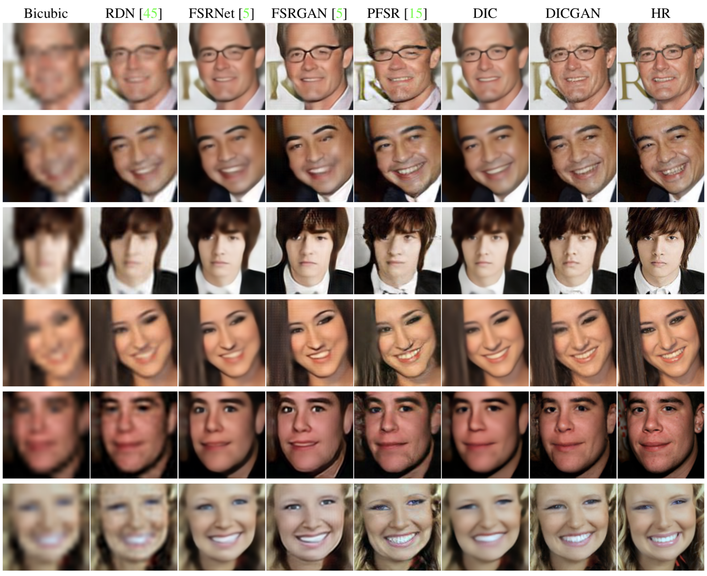

# Deep Iterative Collaboration for Face Super-Resolution
Pytorch implementation of Deep Face Super-Resolution with Iterative Collaboration between Attentive Recovery and Landmark Estimation (CVPR 2020) [[arXiv](https://arxiv.org/abs/2003.13063)]


If you find our work useful in your research, please consider citing:
```
@inproceedings{ma2020deep,
  title={Deep Face Super-Resolution with Iterative Collaboration between Attentive Recovery and Landmark Estimation},
  author={Ma, Cheng and Jiang, Zhenyu and Rao, Yongming and Lu, Jiwen and Zhou, Jie},
  booktitle={Proceedings of the IEEE Conference on Computer Vision and Pattern Recognition (CVPR)},
  year={2020}
}
```

## Dependencies

- Python 3 (Recommend to use [Anaconda](https://www.anaconda.com/download/#linux))
- [PyTorch >= 1.1.0](https://pytorch.org/)
- NVIDIA GPU + [CUDA](https://developer.nvidia.com/cuda-downloads)
- Python packages: `pip install numpy opencv-python tqdm imageio pandas matplotlib tensorboardX` 


## Dataset Preparation

### Download datasets

**CelebA** dataset can be downloaded [here](http://mmlab.ie.cuhk.edu.hk/projects/CelebA.html). Please download and unzip the `img_celeba.7z` file. 

**Helen** dataset can be downloaded [here](http://www.ifp.illinois.edu/~vuongle2/helen/). Please download and unzip the 5 parts of `All images`. 

**Testing sets** for CelebA and Helen can be downloaded from [Google Drive](https://drive.google.com/open?id=1Q1T1smMDRMO1NcjkxbZvotOX93YIVp5e) or [Baidu Drive](https://pan.baidu.com/s/14zJ_lY8iFmk3csHYZmut7Q) (extraction code: 6qhx). 

### Download landmark annotations and pretrained models

**Landmark annotations** for CelebA and Helen can be downloaded in the `annotations` folder from [Google Drive](https://drive.google.com/open?id=1Q1T1smMDRMO1NcjkxbZvotOX93YIVp5e) or [Baidu Drive](https://pan.baidu.com/s/14zJ_lY8iFmk3csHYZmut7Q) (extraction code: 6qhx). 

The **pretrained models** can also be downloaded from the `models` folder in the above links. Then please place them in `./models`. 

## Training

To train a model:

```python
cd code
python train.py -opt options/train/train_(DIC|DICGAN)_(CelebA|Helen).json
```
- The json file will be processed by `options/options.py`. Please refer to [this](./code/options/train/README.md) for more details.

- Before running this code, please modify option files to your own configurations including: 
  - proper `dataroot_HR` and `dataroot_LR` paths for the data loader
  - proper `info_path` for the annotations
  - whether to use a pretrained model and the path of the model
  - the path of the pretrained Feedback HourGlass model (for face landmark detection) if not using a pretrained model
  - the path of the feature extraction model (`LightCNN_feature.pth`) if training a GAN model
  - whether to resume training
  - saving frequency for models and states
  - other hyperparameters
  - loss function, etc. 
  
- During training, you can use Tesorboard to monitor the losses with
`tensorboard --logdir tb_logger/NAME_OF_YOUR_EXPERIMENT`

## Testing

To generate SR images by a model:

```python
cd code
python test.py -opt options/test/test_(DIC|DICGAN)_(CelebA|Helen).json
```

- Similar to training, the configurations can be modified in the json file. Please refer to [this](./code/options/test/README.md) for more details.
- You can find your results in `results/{test_name}/{dataset_name}`. The **PSNR** and **SSIM** values will be stored in `result.json` while the average results will be recorded in `average_result.txt`
- We provide our **DIC** and **DICGAN** models used in our paper that can be downloaded in the `models` folder from [Google Drive](https://drive.google.com/open?id=1Q1T1smMDRMO1NcjkxbZvotOX93YIVp5e) or [Baidu Drive](https://pan.baidu.com/s/14zJ_lY8iFmk3csHYZmut7Q) (extraction code: 6qhx). Then you can modify the directory of pretrained model and LR image sets in option files and run `test.py` for a quick test. 

## Evaluation

To evaluate the SR results by landmark detection:

`python eval_landmark.py --info_path /path/to/landmark/annotations --data_root /path/to/result/images`

- First you need to download the `HG_68_CelebA.pth` from the from [Google Drive](https://drive.google.com/open?id=1Q1T1smMDRMO1NcjkxbZvotOX93YIVp5e) or [Baidu Drive](https://pan.baidu.com/s/14zJ_lY8iFmk3csHYZmut7Q) (extraction code: 6qhx) and put it into the `./models` directory.
- Results will be in `/path/to/result/images/landmark_result.json` and the averaged results will be in `landmark_average_result.txt`.

## Visual Results
<p align="center">
  
</p>

## Reference

The code is based on [SRFBN](https://github.com/Paper99/SRFBN_CVPR19) and [hourglass-facekeypoints-detection](https://github.com/raymon-tian/hourglass-facekeypoints-detection)

